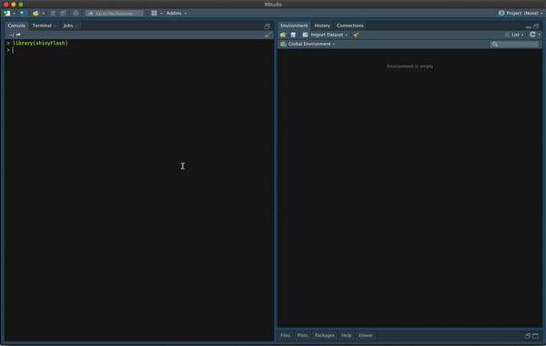
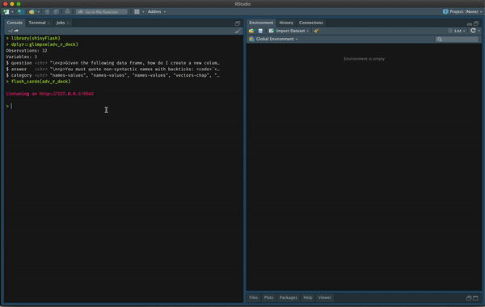
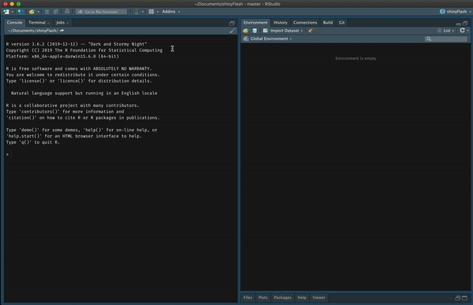

<!-- README.md is generated from README.Rmd. Please edit that file -->

# shinyFlash 

<!-- badges: start -->

[](https://www.tidyverse.org/lifecycle/#experimental)
<!-- badges: end -->

The goal of shinyFlash is to provide easy to use, interactive flash
cards to help you study\! This package contains one primary function:
`flash_cards`. This function will allow you to generate flash cards
either in a shiny app or in an interactive RStudio addin.

## Installation

You can install the development version from
[GitHub](https://github.com/) with:

``` r
# install.packages("remotes")
remotes::install_github("tbradley1013/shinyFlash")
```

## Example

There are two main ways to use the `shinyFlash` pacakge. The first
method is through a shiny application and the second is through an
interactive RStudio Addin. Both implementations have the same effect
although the shiny app has the ability to interactively upload different
datasets in the same session.

``` r
library(shinyFlash)
```

### RStudio Modal

The default mode for the flash cards (i.e. `type = "local"`) will result
in the flash cards appearing as a modal in your RStudio window. If `type
= "local"` then the user must specify a data frame using the `.data`
argument or the path to a valid file with the `path` argument.

``` r
flash_cards(shinyFlash::adv_r_deck)
```



### Shiny app

The shiny app can be launched using the `flash_cards` function:

``` r
flash_cards(type = "shiny")
```

If the function is called without specifying the `.data` or `path`
arguments, the app will launch and present the user with a dialog box
that can be used to select one of the two default card decks or upload a
custom dataset. If the user chooses to upload a custom dataset, it must
be either an `.xlsx`, `.rds`, or `.csv` file with the columns `question`
and `answer`.

Users can also specify a dataset to the `flash_cards` dataset using
either the `.data` or `path` arguments. Just like when specifying a
dataset using the shiny application, the specified dataset must have the
columns `question` and `answer`. If specifying a path, it must be either
a `.xlsx`, `.csv`, or `.rds` file.



### RStudio Addin

This package also comes with two RStudio Addins. Both of these functions
call versions of the local flash cards, but differ in the way the user
specifies the dataset to be used.

The first addin, `shinyFlash`, will look through the Global Environment
for all objects that are valid flash card decks. If there is only one
valid flash card deck then the addin will launch using this dataset. If
there are multiple valid flash card decks, then the user will be asked
to specify which dataset they would like to use in the console.

The second addin, `shinyFlash (file)`, will result in a file system
dialog to appear and allow the user to select the file that they wish to
uplaod to the function, as if through the `path` argument.


